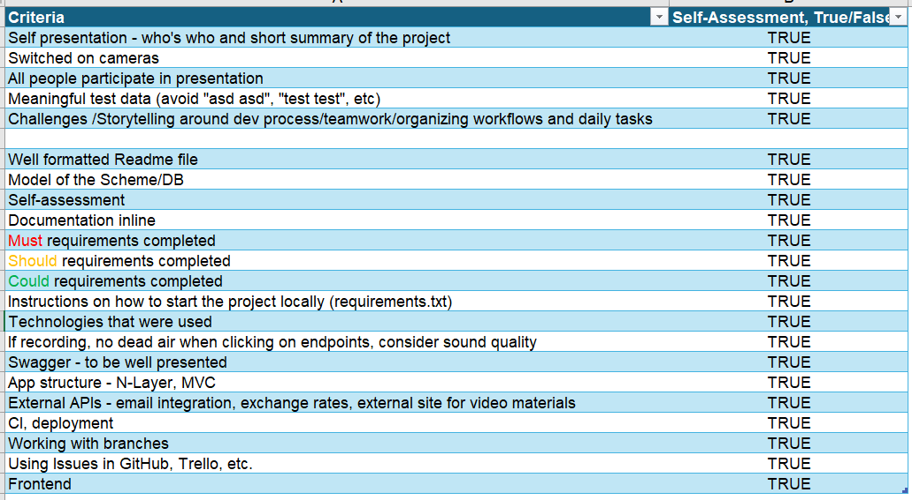

# The Learniverse

## Project Description

This project is an e-learning platform designed to facilitate online learning. It allows students to search for and enroll in online courses, while teachers can publish and manage courses. Admins have control over user registrations, course visibility, and can monitor platform activities. The platform follows the OAuth2 password bearer flow for authentication.


## Features

The platform caters to three types of users: students, teachers, and admins. Students can view, search, and enroll in various courses. They have the ability to track their progress through the courses they are enrolled in and rate these courses. Teachers, on the other hand, can create and manage courses and sections, approve student enrollments, and generate reports on student progress. Teachers also have the ability to edit their account information, excluding their email address.

Admins hold the highest level of control. They can approve teacher registrations, manage all courses and users on the platform, and have the ability to view platform activity in a comprehensive manner. Admins can take actions such as deactivating users, changing users' roles or hiding and deleting courses.

Courses on the platform can be either public or premium, each having unique titles, descriptions, tags, and sections. Students can subscribe to or unsubscribe from these courses, and they can rate them based on their learning experience. Each course's rating is calculated as an average of all provided scores.

Sections within courses contain titles, content, and optional external resource links. 

The platform includes a public part that is accessible without authentication, allowing anonymous users to view course titles, descriptions, and tags. Anonymous users can also search courses by tag but cannot access the full content without registering.

## Technologies Used
- **Backend**: Python, FastAPI, Uvicorn
- **Frontend**: React, HTML, CSS
- **Database**: MySQL (Relational Database)
- **Authentication**: OAuth2 Password Bearer Flow

## Getting Started

### Prerequisites
- Docker Desktop
- Python
- PIP
- MySQL and MySQL Workbench
- Node.js

## How to Install and Run the Backend
### Docker
1. **Download and install Docker**: Ensure you have Docker installed on your computer. You can download it from [docker.com](https://www.docker.com/).

2. **Build the Docker image**: While in the highest root level of the project, run:
    ```bash
    docker build -f backend/Dockerfile -t backapp .
    ```

3. **Run the Docker image**: Open Docker Desktop, run the image, and add port 8000 before running it so you can access it from your computer.

4. **Open the address**: [http://127.0.0.1:8000/docs](http://127.0.0.1:8000/docs)

### Run the project locally:
1. Install Python on your computer.
2. Install PIP.
3. Download and install MySQL and MySQL Workbench, and create a new connection.
4. Open a new SQL tab for executing queries and paste the content from the `databaseFiller_sql` located in `backend/app/api/data`.
5. Open a new SQL tab for executing queries and paste the content from the `database_sql` located in `backend/app/api/data`.
6. Install the requirements:
    ```bash
    pip install -r backend/requirements.txt
    ```
7. Run the application:
    ```bash
    uvicorn backend.main:app --reload
    ```

## How to Install and Run the Frontend

1. **Download and install Node.js**: Ensure you have Node.js installed on your computer. You can download it from [nodejs.org](https://nodejs.org/).

2. **Clone the repository**: Clone the repository to your local machine.
    ```bash
    git clone https://github.com/ADCK-Learniverse/The-Learniverse.git
    ```

3. **Navigate to the frontend directory**:
    ```bash
    cd frontend
    ```

4. **Install the dependencies**:
    ```bash
    npm install
    ```

5. **Install MDB React UI Kit**:
    ```bash
    npm install mdb-react-ui-kit
    ```

6. **Install styled-components**:
    ```bash
    npm install styled-components
    ```

7. **Run the development server**:
    ```bash
    npm run dev
    ```

### Note
Both the frontend and backend need to be running simultaneously to experience the full functionality of the platform.

## Project Structure

- **Backend**:
  - `backend/main.py`: Entry point for the backend application.
  - `backend/app/api/`: Contains API routers, services, definitions and data models.
  - `backend/app/api/data/`: SQL scripts for setting up the database.

- **Frontend**:
  - `frontend/src/`: Contains the main application code.
    - `assets/`: Contains static assets like images and styles.
    - `components/`: Contains React components.
    - `context/`: Contains context providers for state management.
    - `hooks/`: Contains custom React hooks.
    - `App.jsx`: Main application component.
    - `index.css`: Global CSS styles.
    - `main.jsx`: Entry point for the React application.
    - `newsletter.js`: Component for newsletter subscription.
    - `routes.jsx`: Contains application routes.

## Contributing
1. Fork the repository.
2. Create a new branch (`git checkout -b feature-branch`).
3. Make your changes.
4. Commit your changes (`git commit -m 'Add new feature'`).
5. Push to the branch (`git push origin feature-branch`).
6. Create a new Pull Request.

## License
This project is licensed under the MIT License.

## Telerik Self Assessment Form


## Contact
For any questions or feedback, please contact:
- [chavdarcodes@gmail.com](mailto:chavdarcodes@gmail.com)
- [alexandurdaskalov@gmail.com](mailto:alexandurdaskalov@gmail.com)
